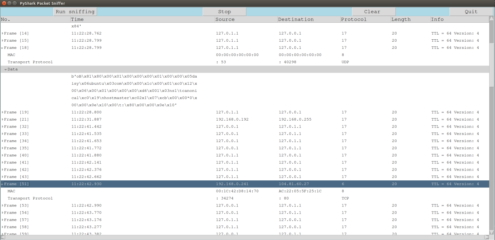
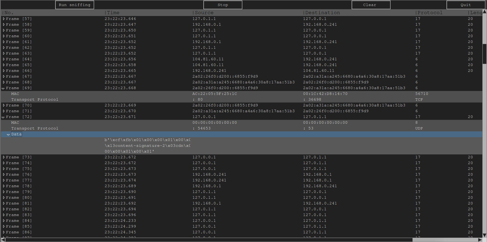
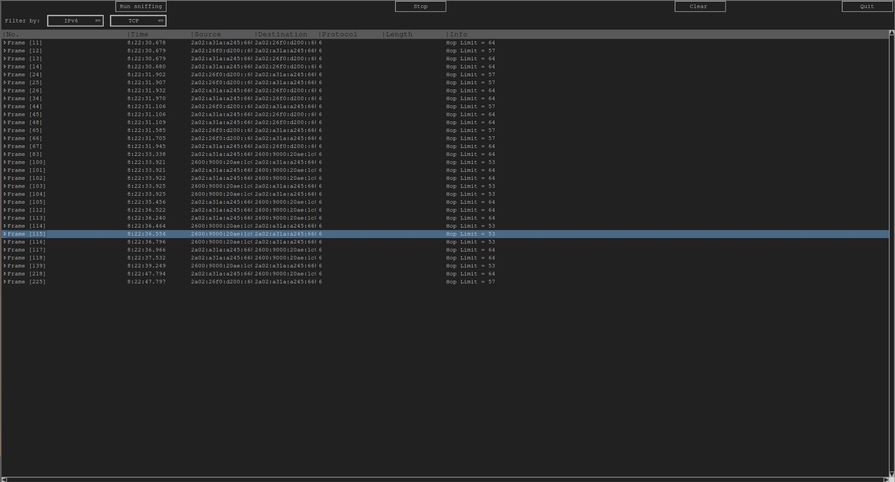

## PROJECT DETAILS ##

PyShark is a GUI pacekt sniffer based on network RAW sockets. Frontend was developed by using ***Tkinter*** framework and backend with help of Python module's ***sockets*** and ***threading***. First one gave possibilty to create raw sockets and recieve all comming data. Second allowed access to multiple threading methods.

      note: works only with systems supporting "AF_PACKET" sockets

Screenshot below:

      update 1: IPv6 support addded, changed into dark mode

      update 2: SCTP support added and filtring options

